# Web3MedicalDApp

ブロックチェーンを活用した Web ３アプリケーション用のリポジトリです。

## 挑戦する STAR 試験

<a href="https://unchain-shiftbase.notion.site/2-Distributed-medical-database-Japanese-18540901b8114aa787e7ec3aa30d5602">概要はこちら</a>

## 設計書

1.  <a href="./docs/design.md">概要設計書</a>
2.  <a href="./docs/page.md">画面設計書</a>

## テスト結果

スマートコントラクトのテスト結果は、<a href="./docs/testResult.md">こちら</a>

## マイグレーションの結果

ローカルでマイグレーションした時の結果

```cmd
Compiling your contracts...
===========================
> Everything is up to date, there is nothing to compile.


Starting migrations...
======================
> Network name:    'development'
> Network id:      5778
> Block gas limit: 6721975 (0x6691b7)


1_deploy_medicalData.js
=======================

   Deploying 'MedicalData'
   -----------------------
   > transaction hash:    0xa2840106c5efab01e8ffedfd5f68239d59753f40d4be75a9c0ebd769d5209efb
   > Blocks: 0            Seconds: 0
   > contract address:    0x2cBd11686a3877c634910d8eEaB539d52c1daB38
   > block number:        814
   > block timestamp:     1655965417
   > account:             0x69273f3CF93e244Cd58449Df5aa8a1eC7b52A019
   > balance:             83.78739006
   > gas used:            2590937 (0x2788d9)
   > gas price:           20 gwei
   > value sent:          0 ETH
   > total cost:          0.05181874 ETH

   > Saving artifacts
   -------------------------------------
   > Total cost:          0.05181874 ETH


Summary
=======
> Total deployments:   1
> Final cost:          0.05181874 ETH
```

goreli ネットワークにデプロイした結果

```cmd
Compiling your contracts...
===========================
> Everything is up to date, there is nothing to compile.


Starting migrations...
======================
> Network name:    'goreli'
> Network id:      5
> Block gas limit: 29941438 (0x1c8debe)


1_deploy_medicalData.js
=======================

   Replacing 'MedicalData'
   -----------------------
   > transaction hash:    0xa61e32c48809c85415ad3dd6a4e435cfa47f20c67b13d2e4777dd9661a5e587f
   > Blocks: 1            Seconds: 13
   > contract address:    0x177acf501eF7d2b090d94fd3bd2BE773736598E1
   > block number:        7167274
   > block timestamp:     1656926735
   > account:             0x51908F598A5e0d8F1A3bAbFa6DF76F9704daD072
   > balance:             63.85409451098500174
   > gas used:            3527517 (0x35d35d)
   > gas price:           1.500000011 gwei
   > value sent:          0 ETH
   > total cost:          0.005291275538802687 ETH

   Pausing for 2 confirmations...
   ------------------------------
   > confirmation number: 1 (block: 7167275)
   > confirmation number: 2 (block: 7167276)
   > Saving artifacts
   -------------------------------------
   > Total cost:     0.005291275538802687 ETH


2_deploy_SBT.js
===============

   Deploying 'SBT'
   ---------------
   > transaction hash:    0x98e6a0b872675175a9713808980b14ffa67ee6cde4befc03afa45f9ddbc9b046
   > Blocks: 1            Seconds: 9
   > contract address:    0xd18d0D5c3C8f915865069Fe11b25228a737E9925
   > block number:        7167277
   > block timestamp:     1656926784
   > account:             0x51908F598A5e0d8F1A3bAbFa6DF76F9704daD072
   > balance:             63.852992720476187416
   > gas used:            734527 (0xb353f)
   > gas price:           1.500000012 gwei
   > value sent:          0 ETH
   > total cost:          0.001101790508814324 ETH

   Pausing for 2 confirmations...
   ------------------------------
   > confirmation number: 1 (block: 7167278)
   > confirmation number: 2 (block: 7167279)
   > Saving artifacts
   -------------------------------------
   > Total cost:     0.001101790508814324 ETH


Summary
=======
> Total deployments:   2
> Final cost:          0.006393066047617011 ETH
```

それ以外のマイグレーションの記録は<a href="./docs/deploy.md">こちら</a>

## クリアすべき課題

1. Ethereum,Polygon,Solana のいずれかのネットワークにデプロイすること。
2. 患者と医療従事者の両方が、自分のウォレットをアプリケーションに接続できる
3. 患者は、アプリケーションのダッシュボードで、自分の秘密鍵を使って、自分の医療データを閲覧することができる
4. 患者は自分の医療データを編集することはできない
5. 患者は、医療提供者に自分の医療データへのアクセスを提供することができる
6. 医療従事者は患者の医療データを編集する際、患者に承認を求める必要がある
7. 患者が承認すると、医療従事者はその患者の医療データを編集することができる
8. 医療データのフォーマットは以下の通り:
   - 患者名
   - 患者様の血液型
   - 最終更新日時
   - 最終更新日時、最終更新医療機関
9. 患者は自身の医療データへのアクセス権限を一度承認した医療提供者から再度制限できる(患者の医療提供者が変更になった場合等に備えて)

## 各画面のイメージ

### 1. Connect Wallet 画面

ウォレットで接続する前の画面  
右上のボタンから接続する。

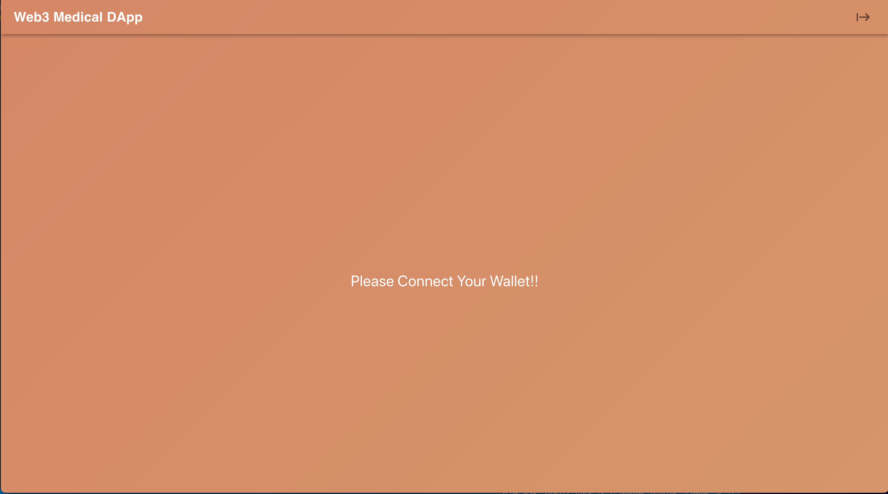

### 2. Home 画面

この画面は接続したウォレットのアドレスによって描画される内容が変化します。

| No. | パターン                                                                                     | 描画される内容                                         |
| --- | -------------------------------------------------------------------------------------------- | ------------------------------------------------------ |
| 1   | 患者で医療データが未登録の場合                                                               | メッセージが描画されるだけ                             |
| 2   | 患者で医療データが登録されている場合                                                         | 医療データが描画される                                 |
| 3   | 医者の場合                                                                                   | 初期状態では検索画面が描画される。                     |
| 4   | 医者の場合で検索したアドレスから承認権限が付与されていなかった場合                           | 承認権限を要求するボタンを描画する。                   |
| 5   | 医者の場合で検索したアドレスから承認権限が付与されて且つ医療データが登録されていなかった場合 | 医療データ入力フォームと新規登録ボタンを描画する。     |
| 6   | 医者の場合で検索したアドレスから承認権限が付与されて且つ医療データが登録されていた場合       | 医療データ入力フォームと更新・削除ボタンをを描画する。 |

#### Home 画面 パターン 1

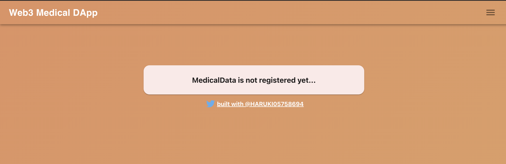

#### Home 画面 パターン 2

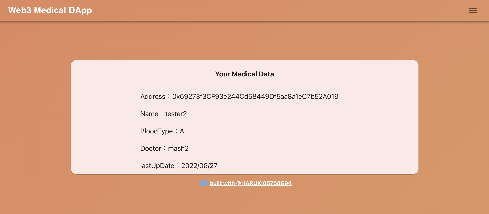

#### Home 画面 パターン 3

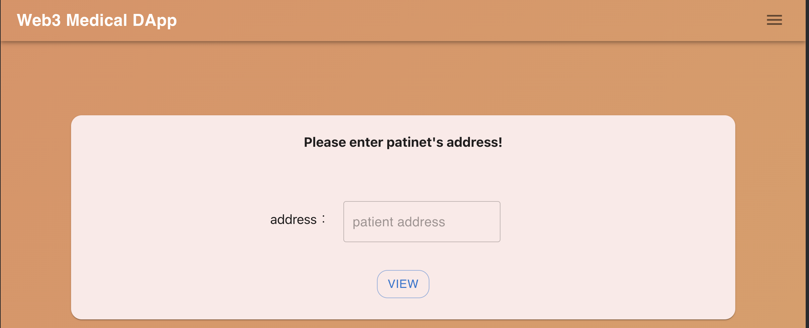

#### Home 画面 パターン 4

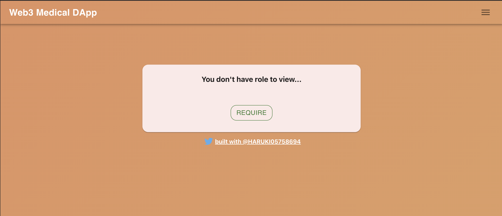

#### Home 画面 パターン 5

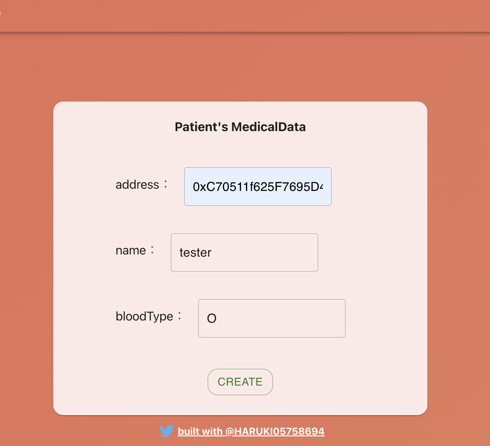

#### Home 画面 パターン 6

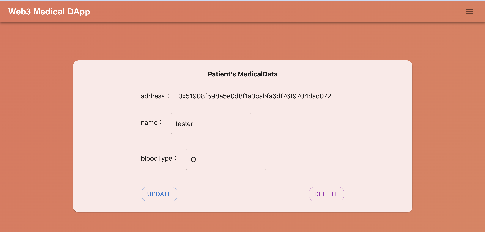

### 3. Regist 画面

この画面は管理者権限専用の画面で新規に医者を登録することができる画面になります。  
管理者以外がアクセスすると入力フォーム等は描画されません。

#### Regist 画面 管理者の場合

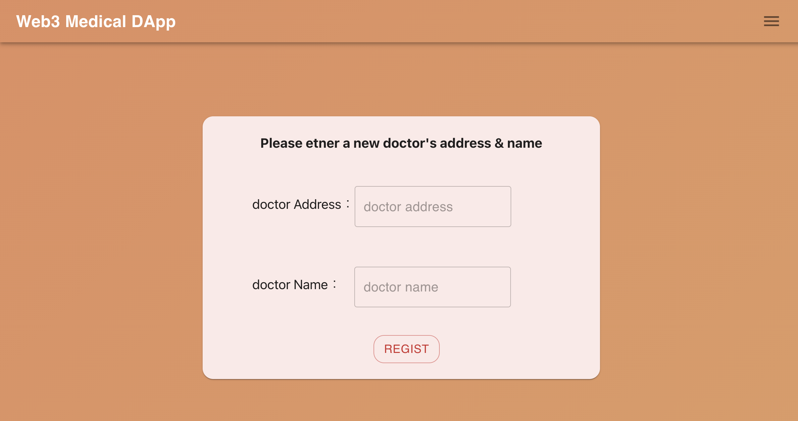

#### Regist 画面 管理者以外の場合

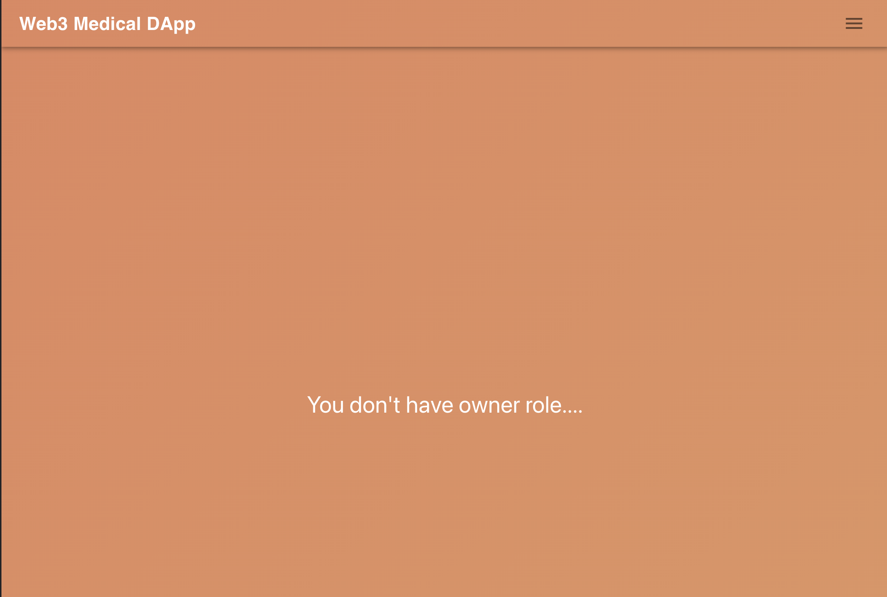

### 4. DoctorInfo 画面

この画面も患者と医者で画面表記が変化します。  
医者の場合は自分のアドレスと名前が表示されます。  
患者の場合は、このコントラクトに登録されている医者の情報と承認権限を付与するボタン・剥奪するボタンが描画されます。(医者から承認権限を要求されている場合にはその旨のメッセージも表示されます。)

#### DoctorInfo 画面 医者の場合

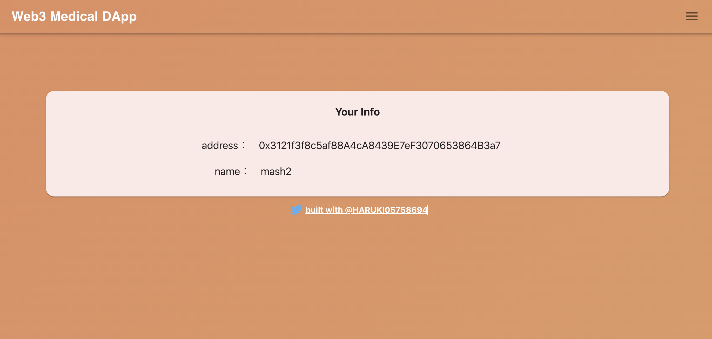

#### DoctorInfo 画面 患者の場合

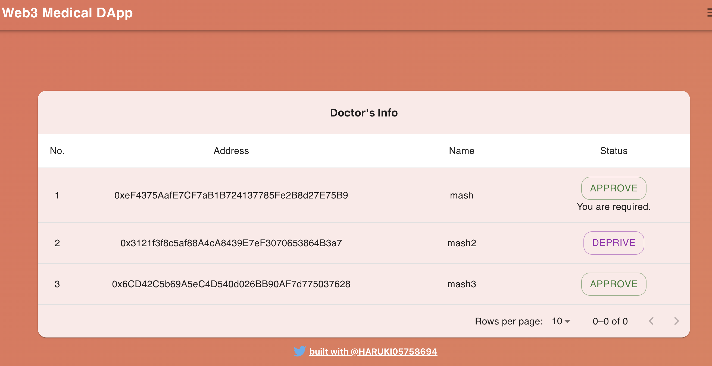

### SBT を利用して医療データを管理する場合

下記資料が参考になりそうです。

1. <a href="https://www.ieice.org/cs/icn/wp-content/uploads/2022/05/c4a87292de7a9347ea7f0414c8b9a291.pdf">ブロックチェーンを⽤いたデータ共有における個⼈主導のアクセスコントロールの提案</a>

2. <a href="https://www.intellilink.co.jp/column/fintech/2021/052600.aspx">ブロックチェーン テクノロジーコラム　拡張性とプライバシーを備えたオフチェーンデータの管理（後編）</a>
