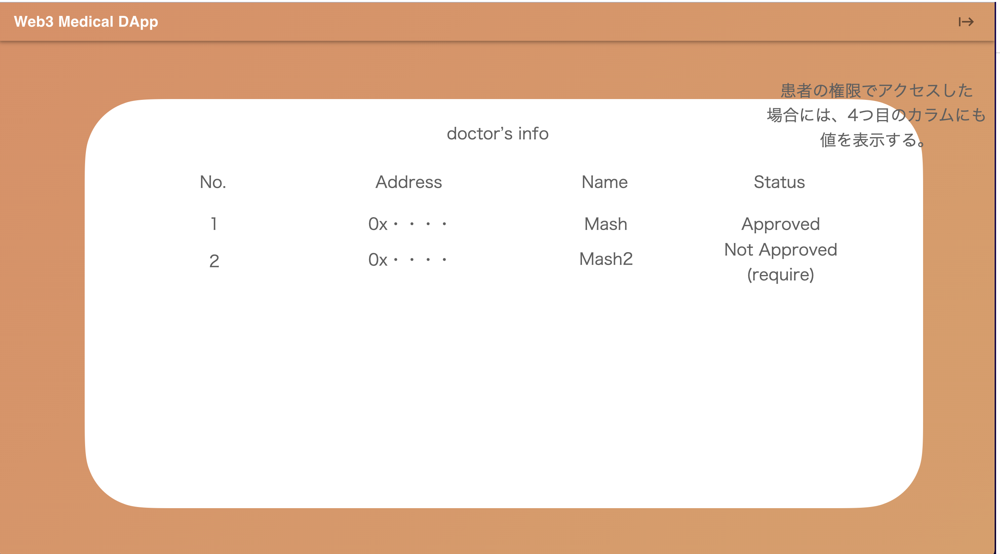
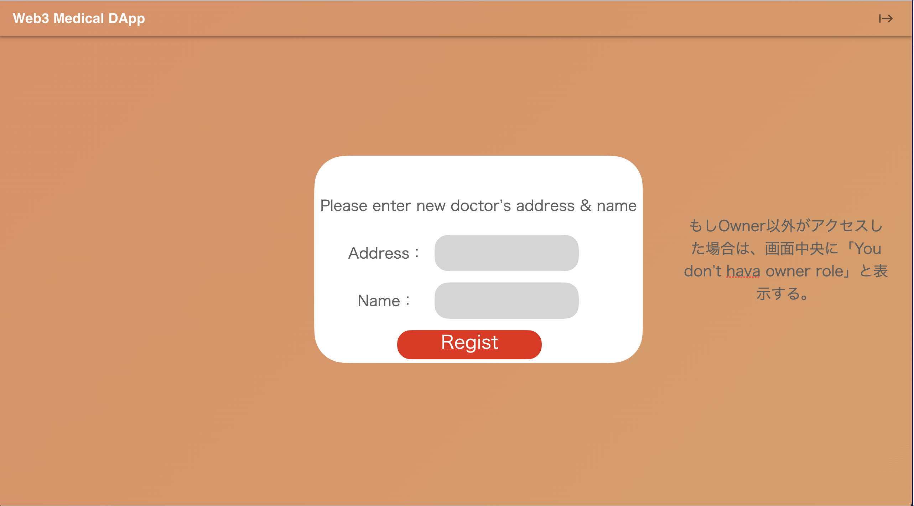
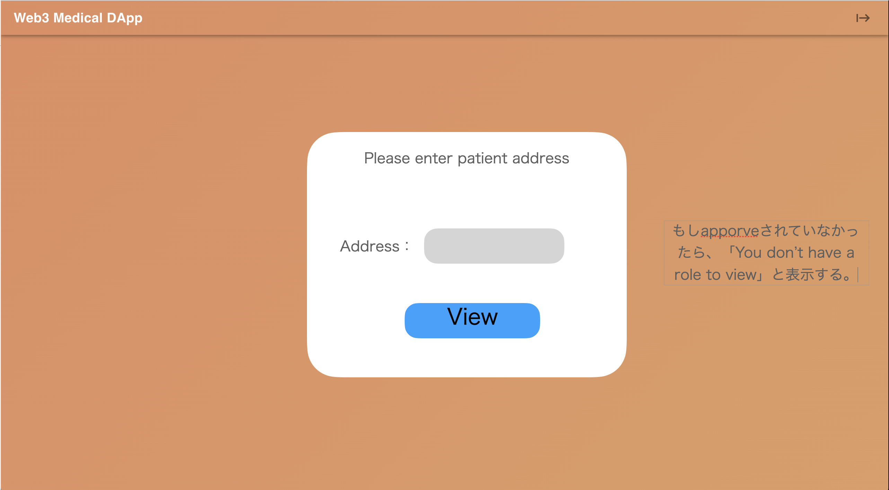
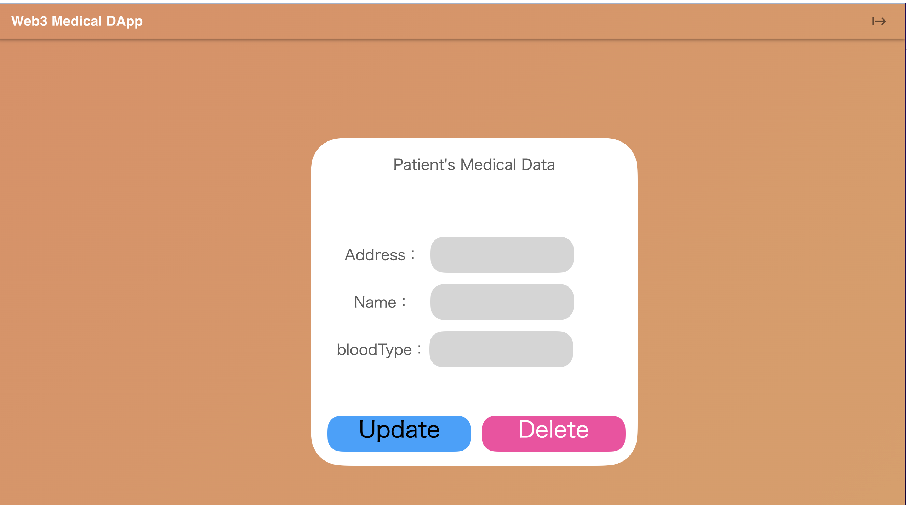
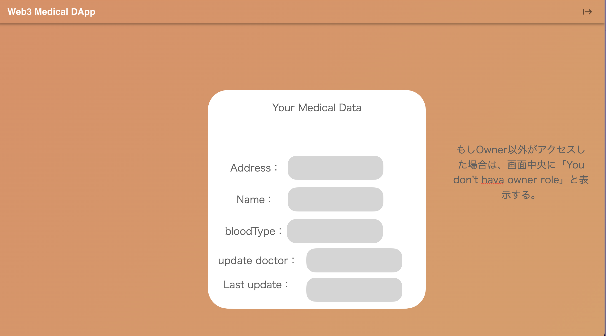

# 画面設計書

※ 実装前段階のモックアップイメージになります。

## ConnectWallet前の画面(共通)

Connectはシンプルに。右上のボタンからConnect Walletする。  

## 登録済みの医師の情報を一覧表示する画面(共通)

## 管理者用画面イメージ

## 医者用画面イメージ(初期表示)

## 医者用画面イメージ(編集モード)

## 患者用画面イメージ(医療データ確認)

